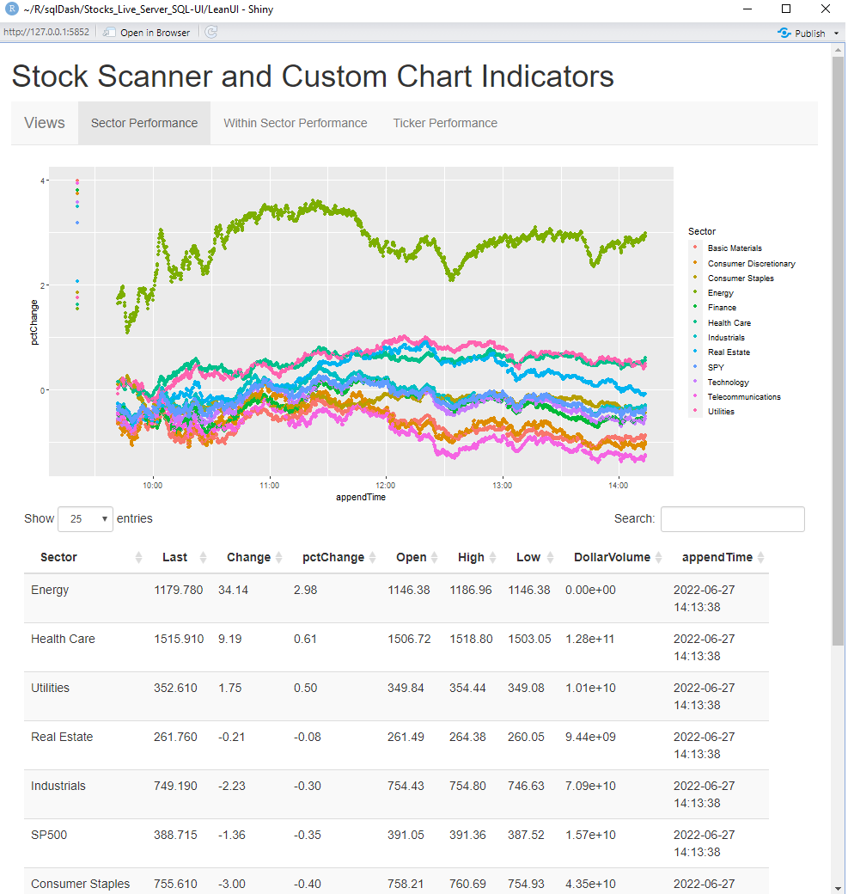

Readme
================

# Overview

This project is a personal dashboard to help view the stock market each day.  Most existing products tend to have subscription requirements or are limited in the number of functions that can be applied to the data / the number of screeners or alerts that can be implmented.  This project is intended to be used as a supplement to free products to help scan, explore, and experiment with custom strategies.

There are three separate structures used in this project.  

* [DataPulling and Calculations](./DataPulling and Calculations.R) controls an interface with Yahoo Finance to pull in stock quotes at a specified interval.  Custom indicators are calculated as the data comes in to minimize calculations on the UI portion.  Results are uploaded to a private SQL server
* A personal SQL Server.  Tables currently include lookups for general ticker and sector information as well as the workhorse table that logs the quotes.  A full day of quotes for 500 tickers at 1 quote / 10 seconds is ~180MB of data.
* [app.R](./LeanUI/app.R) An R Shiny Dashboard to act as a ui for the incoming data.  Views exist for overall market health, within sector performance, and single ticker performance.

# Preview

Tab 1: 

Tab 2: 
Tab 3: 

# Instructions for Use
* Most of the setup work will be establishing your own SQL server and updating the connection string in the 'global variables' code chunk to point to it. Table designs are available [here](https://github.com/fd54386/Stocks_Live_Server_SQL-UI/blob/main/SQLTableDesign.png).  Note that the UI queries a view that's a Select * from dbo.YahooQuotesAndSlope in order to avoid row lock issues.

* Data is only plotted for any stock quotes pulled today, so the datapulling script needs to be running before the shiny app will have anything to present.  For consistent data collection, the DataPulling and Calculations.R script should be pulled into a scheduled task.  Note that extended hours trades do not update the quotes, so datacollection is only worthwhile from 9:30am to 4:00pm Eastern Time.

I think that covers it in broad strokes, but certainly let me know if you try to use this project and find something is obscured.  I believe it's partitioned and commented well enough that it should be quick to skim and troubleshoot.

#Possible Future Work - 6-27-2022

Further development on this public project is currently on hiatus. Polish could certainly be applied to chart formatting, but polish should be an ongoing secondary effort while the focus is to ensure software is useful for the folks who don't mind tinkering on their own.  My next efforts will be privately exploring various trade strategies to see if they might be successful.  

Interesting public features I may explore soon are:
* Plotly graphs, for interactivity
* Yahoo Quotes may time out, needs to fail more gracefully - rare occurrence so far.
* E-mail or other notifications for interesting indicator or price action behavior.
* Flexibility to hook into API feeds for different timescales
